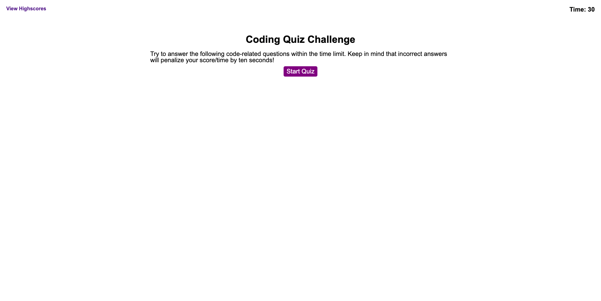
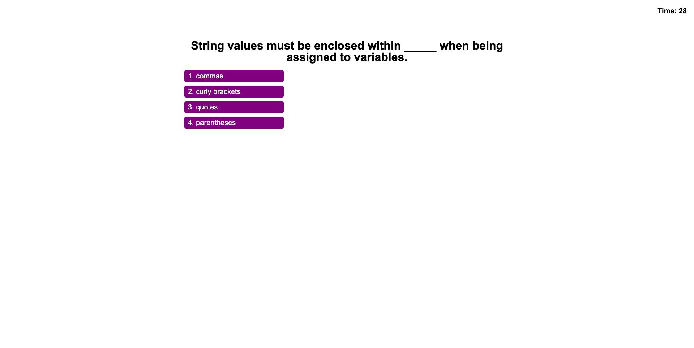
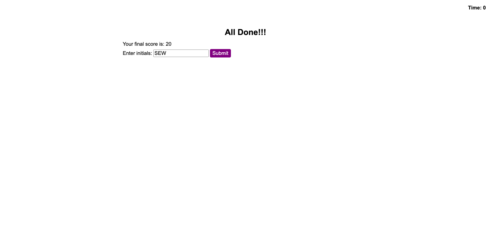
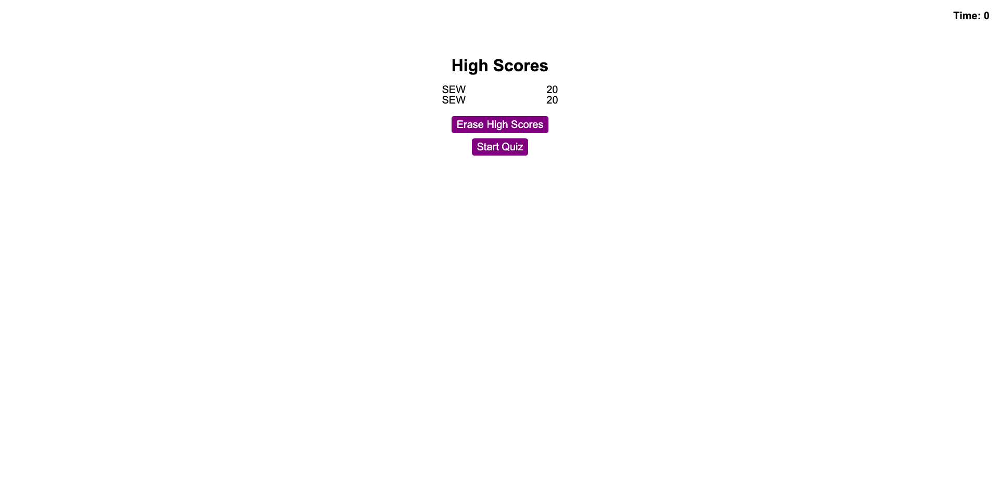

# code-quiz

Code-quiz is a multiple choice quiz designed to test and improve a player's knowledge of JavaScript.  It's built with HTML, CSS, and JavaScript, with Javascript driving the HTML viewable on the page.

## Link to Deployed Application

https://swillrich5.github.io/code-quiz/#

## GitHub Repository

https://github.com/swillrich5/code-quiz/tree/main/assets/js

# Requirements

Code-quiz has the following requirements: 

* The game begins after the user clicks the start button.
* When the start button is clicked, the user is presented with a multiple-choice question.
* After the user chooses one of the answers:
  * The user is presented feedback on their choice ("Correct" or "Wrong")
  * They are presented with another question.
  * Time is subtracted from the clock.
* When all of the questions have been or the timer reaches zero, the game is over:
  * The user see their final score
  * The user enters their initials 
  * The user views the high scores, which includes their scores and the scores of other players.
  * The high scores list is maintained between browser sessions

  ## Application Images

Starting Screen

Game Question 

Game Over 

High Scores 

